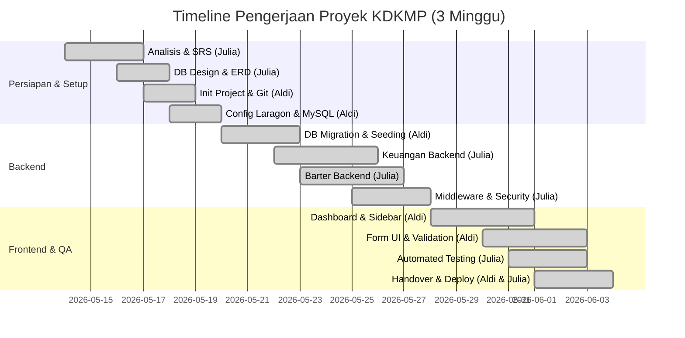

# Laporan Progres Proyek
## Pengembangan Sistem Informasi Komoditas Desa dan Keuangan Modern (KDKMP)

### Ringkasan Eksekutif
Laporan ini menyajikan kemajuan pengerjaan proyek Sistem Informasi KDKMP dari awal perancangan hingga penyelesaian akhir. Proyek ini diselesaikan secara penuh oleh kolaborasi 2 anggota aktif kelompok: **Aldi Burung** dan **Julia**.

> [!NOTE]
> **Catatan Penyesuaian Anggota Tim:**
> Pada awalnya, kelompok ini dibentuk dengan 5 orang anggota untuk membagi beban kerja. Namun, seiring berjalannya proyek, 3 orang anggota lainnya tidak berpartisipasi aktif (non-aktif) karena kendala internal masing-masing. Untuk memastikan proyek tetap selesai tepat waktu dan berkualitas tinggi, seluruh pengerjaan dari sisa fase dialihkan dan diselesaikan berdua oleh **Aldi** dan **Julia** dalam kurun waktu **3 minggu**.

---

## 1. Kronologi & Milestone Proyek

---

## 2. Rincian Progres per Fase

### 2.1 Fase 1: Persiapan & Setup (Minggu 1)
* **Hasil Kerja:**
  * Penyusunan dokumen SRS (Software Requirements Specification) secara detail oleh Julia.
  * Pembuatan desain skema database relasional (ERD) oleh Julia.
  * Inisialisasi Git repository dan setup struktur awal project Laravel oleh Aldi.
  * Konfigurasi Laragon dan MySQL database local oleh Aldi.

### 2.2 Fase 2: Pembangunan Backend & Database (Minggu 2)
* **Hasil Kerja:**
  * Pembuatan database migrations, seeders, dan model relationships oleh Aldi.
  * Penulisan logika controller untuk modul Keuangan dan Termin oleh Julia.
  * Penulisan logika controller untuk modul Barter dan stok komoditas oleh Julia.
  * Penerapan pembatasan akses (*Authorization*) menggunakan custom middleware `CheckRole` dan security policies oleh Julia.

### 2.3 Fase 3: Frontend, Testing, & Deployment (Minggu 3)
* **Hasil Kerja:**
  * Penataan layout dashboard dan sidebar dinamis responsif oleh Aldi.
  * Desain form input transaksi & komoditas beserta validasi input frontend oleh Aldi.
  * Pembuatan Automated Testing Suite (Feature & Unit Tests) oleh Julia.
  * Dokumentasi akhir sistem dan finalisasi deployment oleh Aldi & Julia.

---

## 3. Pembagian Kerja Aktual (Aldi & Julia)

| Anggota Tim | Peran Utama | Modul / Fitur yang Diselesaikan |
|-------------|-------------|---------------------------------|
| **Aldi Burung** | Project Manager & Fullstack Developer | - Setup Git & Konfigurasi Awal - Perancangan Database & Migrasi MySQL - Desain Layout UI (Dashboard, Forms, Sidebar) - Penyempurnaan Tampilan Responsive |
| **Julia** | System Analyst & Fullstack Developer | - Analisis Dokumen Kebutuhan (SRS) - Pembuatan Controller & Logika Keuangan & Barter - Penerapan Security Policy & CheckRole Middleware - Pembuatan Unit/Feature Testing & Dokumentasi Proyek |

---

## 4. Status Akhir Proyek
* **Status Aplikasi:** **100% Selesai & Berjalan Lancar**
* **Database:** MySQL Terkoneksi
* **Pengujian:** Lulus pengujian otomatis (Automated Unit/Feature Tests) dan pengujian manual.
