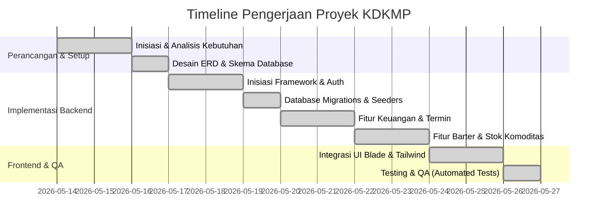

# Laporan Progres Proyek
## Pengembangan Sistem Informasi Komoditas Desa dan Keuangan Modern (KDKMP)

### Ringkasan Eksekutif
Laporan ini menyajikan kemajuan pengerjaan proyek Sistem Informasi KDKMP dari awal perancangan hingga penyelesaian akhir. Proyek ini diselesaikan secara penuh oleh kolaborasi 2 anggota aktif kelompok: **Aldi Burung** dan **Julia**.

> [!NOTE]
> **Catatan Penyesuaian Anggota Tim:**
> Pada awalnya, kelompok ini dibentuk dengan 5 orang anggota untuk membagi beban kerja. Namun, seiring berjalannya proyek, 3 orang anggota lainnya tidak berpartisipasi aktif (non-aktif) karena kendala internal masing-masing. Untuk memastikan proyek tetap selesai tepat waktu dan berkualitas tinggi, seluruh pengerjaan dari sisa fase dialihkan dan diselesaikan berdua oleh **Aldi** dan **Julia**.

---

## 1. Kronologi & Milestone Proyek

---

## 2. Rincian Progres per Fase

### 2.1 Fase 1: Perancangan & Analisis (Minggu 1)
* **Hasil Kerja:**
  * Penyusunan dokumen SRS (Software Requirements Specification).
  * Pembuatan desain skema database relasional (ERD) yang mencakup tabel `users`, `transactions`, `commodities`, `barter_requests`, dan `termins`.
  * Pembagian modul hak akses (Role-Based Access Control) antara aktor Keuangan dan aktor Barter.

### 2.2 Fase 2: Pembangunan Backend & Database (Minggu 1 - 2)
* **Hasil Kerja:**
  * Instalasi framework Laravel 11 dan setup boilerplate menggunakan Laravel Breeze untuk modul autentikasi.
  * Pembuatan seluruh file migrasi database dan pengisian data uji (*database seeding*) untuk mempercepat demo aplikasi.
  * Penulisan logika bisnis di Controller:
    * `KeuanganController.php` & `TerminController.php` (Keuangan).
    * `BarterController.php` & `BarterRequestController.php` (Barter).
  * Penerapan pembatasan akses (*Authorization*) menggunakan custom middleware `CheckRole` dan Laravel Gates/Policies untuk mencegah bypass URL antarmenu.

### 2.3 Fase 3: Integrasi Frontend & UI (Minggu 2)
* **Hasil Kerja:**
  * Penataan layout dashboard agar responsif dan modern dengan tema CSS Tailwind.
  * Pembuatan navigasi sidebar dinamis yang menyesuaikan tampilan berdasarkan peran (role) pengguna yang sedang login.
  * Penyempurnaan form input transaksi dan komoditas dengan validasi yang informatif dan user-friendly.

### 2.4 Fase 4: Pengujian & Penyempurnaan Akhir (Minggu 2 - Selesai)
* **Hasil Kerja:**
  * Pembuatan Automated Testing menggunakan suite bawaan Laravel untuk memverifikasi fungsionalitas login dan pembatasan akses role secara ketat.
  * Migrasi database dari SQLite ke MySQL pada server lokal (Laragon) untuk simulasi deployment yang realistis.
  * Penyusunan dokumentasi akhir sistem di file `README.md` dan `DOKUMENTASI_KDKMP.md`.

---

## 3. Pembagian Kerja Aktual (Aldi & Julia)

| Anggota Tim | Peran Utama | Modul / Fitur yang Diselesaikan |
|-------------|-------------|---------------------------------|
| **Aldi Burung** | Project Manager & Fullstack Developer | - Setup Git & Konfigurasi Awal - Perancangan Database & Migrasi MySQL - Desain Layout UI (Dashboard, Forms, Sidebar) - Penyempurnaan Tampilan Responsive |
| **Julia** | System Analyst & Fullstack Developer | - Analisis Dokumen Kebutuhan (SRS) - Pembuatan Controller & Logika Keuangan & Barter - Penerapan Security Policy & CheckRole Middleware - Pembuatan Unit/Feature Testing & Dokumentasi Proyek |

---

## 4. Status Akhir Proyek
* **Status Aplikasi:** **100% Selesai & Berjalan Lancar**
* **Database:** MySQL Terkoneksi
* **Pengujian:** Lulus pengujian otomatis (Automated Unit/Feature Tests) dan pengujian manual.
